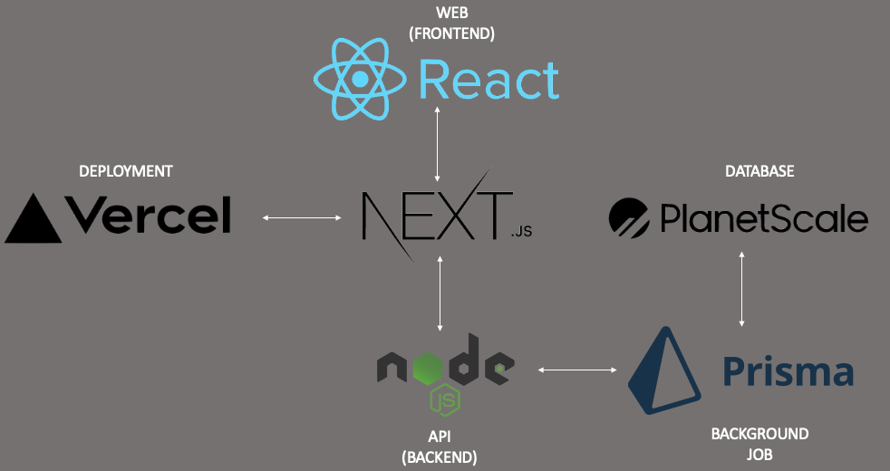

# Code Stack 

# Getting started with NextJS

1. Initialize a git repository in Git Hub
2. Make a local copy of the repo
    ```bash
        git clone https://github.com/jbenite2/Introspect
    ```
3. Install next, react and react-dom in your project folder:
    ```bash
     npm install next react react-dom
    ```
4. Create a Next Project
    ```bash
        npx create-next-app@latest .
    ```
5. Open package.json and add the following
    ```json
    "scripts": {
        "dev": "next dev",
        "build": "next build",
        "start": "next start",
        "lint": "next lint"
    }
    ```
6. Download dependencies
    ```bash
     npm install
    ```
7. Start development server
    ```bash
     yarn dev
    ```

# Setting up PlanetScale

1. Make an account in PlanetScale. Keep in mind you can only create one database using the free tier so name it carefully.
2. Install the PlanetScale CLI
    ```bash
    brew install planetscale/tap/pscale
    ```
3. Log into your newly created PlanetScale account through the CLI
    ```bash
     pscale auth login
    ```
4. Create you new db (you only have 1 so choose the name carefully)
    ```bash
    pscale create <DATABASE_NAME>
    ```
5. Start making changes to your newly crated relational database
    ```bash
    pscale shell <DATABASE_NAME> main
    ```
6. Define a file called '.env' inside pages folder
    ```bash
    touch .env
    ```
7. In that .env file, define DATABASE_URL correctly using this skeleton variable
    ```bash
    DATABASE_URL='mysql://<USERNAME>:<PASSWORD>@<HOST>/<DATABASE_NAME>?sslaccept=strict'
    ```
8. Run this command to extract the necessary information for step 7. Be sure to modify that DATABASE_URL with your credentials.
    ```bash
     pscale password create <DATABASE_NAME> <BRANCH_NAME> <PASSWORD_NAME>
    ```

# Setting up Prisma

1. Initialize Prisma elements inside the pages folder
    ```bash
     npx prisma init
    ```
2. Set the schema.prisma file to this (per documentation)

    ```bash
     generator client {
         provider = "prisma-client-js"
     }

     datasource db {
         provider = "mysql"
         url = env("DATABASE_URL")
     }
    ```

3. You can write and edit schemas in the above schema.prisma file like this for example:

    ```bash
        generator client {
            provider = "prisma-client-js"
        }

        datasource db {
            provider = "mysql"
            url = env("DATABASE_URL")
        }

        model Books {
            id        Int      @default(autoincrement()) @id
            title     String   @unique
            pages     Int
            author    String
        }
    ```

4. Perform a push or pull to synchronize your changes with PlanetScale via Prisma
    ```bash
     npx prisma db push
    ```
5. Run a local proxy to your database, which allows a simpler way to connect to your database when running your app locally
    ```bash
    pscale connect <DATABASE_NAME> main --port 3309
    ```

# Deployment through Vercel

1.  In PlanetScale Website, promote main branch to production
    > Important to note that PlanetScale won't let you do this unless each table has a primary key attibute.
2.  Create an account on Vercel
3.  Choose the Git Repository where the project is stored
4.  Prisma Client won't be generated when deploying to Vercel and as a result you'll notice the calls to the API endpoint return with 500 errors. To fix this nuisance add this to your package.json file:
    ```json
    {
        "scripts": {
            ...
            "postinstall": "prisma generate"
        },
        ...
    }
    ```
5.  Verify your endpoints are working correctly by running a GET request on Insomnia:
    ```bash
    GET https://powerhouse-nu.vercel.app/api/users
    ```
6.  Easily deploy using Vercel

# Authentication

We are leveraging [next-auth](https://next-auth.js.org/) as our authentication library

endpoints `/api/auth/*` - `signIn` - `callback` - `signOut` - etc.

Providers are found in the /pages/api/auth/[...nextauth].js file

We support - Github

# Q/A

-   If you get this error: The column `(not available)` does not exist in the current database.
    ```bash
        npx prisma db push
    ```
-   If you're getting a DDL error try demoting the main branch in Planet Scale
-   If the endpoint call works locally but not in Vercel, make sure the prisma and .env file are in the root folder NOT in the pages folder.
